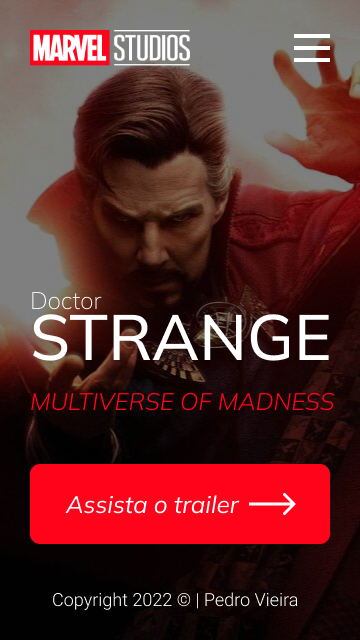
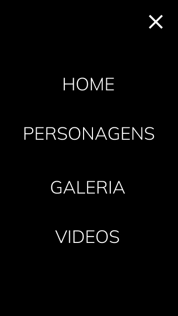

# Doctor Strange concept

Projeto construido durante as aulas de LIMA, no curso de Desenvolvimento de Sistemas do [SENAI Jandira](https://jandira.sp.senai.br/), com orientação do Prof. [Fernando Leonid](https://github.com/fernandoleonid)

</img>

</img>
</img>

---

## Qual era o objetivo do projeto?
O objetivo era criar uma landing page com base no design feito no figma, aprendendo a estrutura do HTML, CSS, JS e conceitos de responsividade.

---
## O que é uma Landing Page?
Landing Pages são paginas com foco principal na conversão de visitantes, assim, essas paginas possuem uma estética mais minimalista comparada com os sites tradicionais.

---
## Tecnologias usadas
- HTML 5
- CSS 3
- JavaScript
- Figma

---
## Links
- [Resultado](https://pedrovs3.github.io/Doctor-Strange-concept/)
- [Projeto no Figma](https://www.figma.com/file/WVkAN96QHqC4PkLe6BCxrk/Projeto-Lima1--Doctor-Strange?node-id=7%3A26)
- [Código](https://github.com/pedrovs3/Doctor-Strange-concept)

---
## Autor
[Pedro Vieira](https://github.com/pedrovs3)
